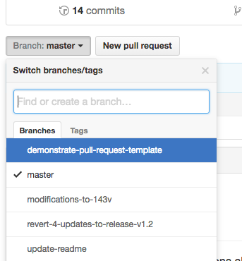

###### TOP
# Coding Concepts Sprint 3 Materials - Git for Teams
<!-- 
* [Team-based Software Development](teamBasedSoftwareDevelopment.md)
* [Github and Teams](githubAndTeams.md)
* [Pulls and Pull Requests](pullsAndPullRequests.md)
* [Branching](branching.md)
* [Conflict Resolution](conflcitResolution.md)
* [Tags and Releases](tagsAndReleases.md)
* [Stashing](stashing.md) -->
```
git status : check which branch you are on and if there are any changes (tracked or un-tracked)
git branch <branch> : creates a new branch (you have not switched to this branch yet)
git checkout <branch> : switch to another branch

git add -A : add all changes made on your branch
git commit -m "meaningful commit message" : commit changes made on your branch
git push origin <branch> : push changes to your branch

create pull request : github will prompt you to review your change and create a pull request
merge pull request : review any conflicts and merge
git pull origin master : pull any remote changes to your local repository
```
## GitHub and Teams

[Back to Top](#TOP)
## Branching
A branch represents an independent line of development. Branches serve as an abstraction for the edit/stage/commit process. You can think of them as a way to request a brand new working directory, staging area, and project history. New commits are recorded in the history for the current branch, which results in a fork in the history of the project.


Create a new branch called `<branch>`. This does not checkout the new branch.
````
git branch <branch>
````
In Git terms, a "checkout" is the act of switching between different versions of a target entity. The git checkout command operates upon three distinct entities: files, commits, and branches.
````
git checkout -b <new-branch>
````
The above example simultaneously creates and checks out `<new-branch>`. The -b option is a convenience flag that tells Git to run git branch `<new-branch>` before running git checkout `<new-branch>`.
```
git add -A
git commit -m "meaningful message"
git push origin <new-branch>
```
To push local changes on your branch to the remote repo run the same three commands (add, commit, push). When you push you must specify the branch name using `origin <new branch>`
```
git pull origin master
```
To pull remote changes to your local repository use `git pull origin master`. By specifying the `master` branch in your pull you can get all merged changes from all other branches.

[Back to Top](#TOP)
## Pulls and Pull Requests
Once you have pushed to your remote branch navigate to GitHub to manage pull requests in the repository. Select `new pull request` on your repo code page and compare between the master and your branch. You will be notified if the branch you are creating a pull request has conflicts with the master branch.




[Back to Top](#TOP)
## Conflict Resolution

Version control systems are all about managing contributions between multiple distributed authors ( usually developers ). Sometimes multiple developers may try to edit the same content. If Developer A tries to edit code that Developer B is editing a conflict may occur. To alleviate the occurrence of conflicts developers will work in separate isolated branches. The git merge command's primary responsibility is to combine separate branches and resolve any conflicting edits.
```
<<<<<<< HEAD
=======
>>>>>>> new_branch_to_merge_later
```
Think of these new lines as "conflict dividers". The ======= line is the "center" of the conflict. All the content between the center and the <<<<<<< HEAD line is content that exists in the current branch master which the HEAD ref is pointing to. Alternatively all content between the center and >>>>>>> new_branch_to_merge_later is content that is present in our merging branch.

[Merging Source](https://www.atlassian.com/git/tutorials/using-branches/merge-conflicts)

[Back to Top](#TOP)
## Merging


Merging is Git's way of putting a forked history back together again. The `git merge` command lets you take the independent lines of development created by git branch and integrate them into a single branch. GitHub supports merging.

Merge a pull request into the upstream branch when work is completed. Anyone with push access to the repository can complete the merge. By default, any pull request can be merged at any time, unless the head branch is in conflict with the base branch. If you decide you don't want the changes in a topic branch to be merged to the upstream branch, you can close the pull request without merging.

[Branching Source](https://www.atlassian.com/git/tutorials/using-branches) |  [Merging Source](https://www.atlassian.com/git/tutorials/using-branches/git-checkout)

[Back to Top](#TOP)
## Team Based Software Development


[Back to Top](#TOP)
<!-- ## Tags and Releases

[Back to Top](#TOP)
## Stashing

[Back to Top](#TOP) -->
## Assignments
* Lecture Gist : [placeholder](github.com)
* In Class Assignment Link : [placeholder](github.com)
* In Class Assignment Answer Gist : [placeholder](github.com)
* Classwork Assignment Link : [placeholder](github.com)
* Classwork Assignment Answer Gist : [placeholder](github.com)
* Classwork Assignment Video Walk through : [placeholder](github.com)

## [Back to Top](#TOP)